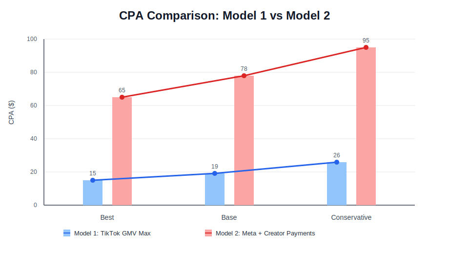
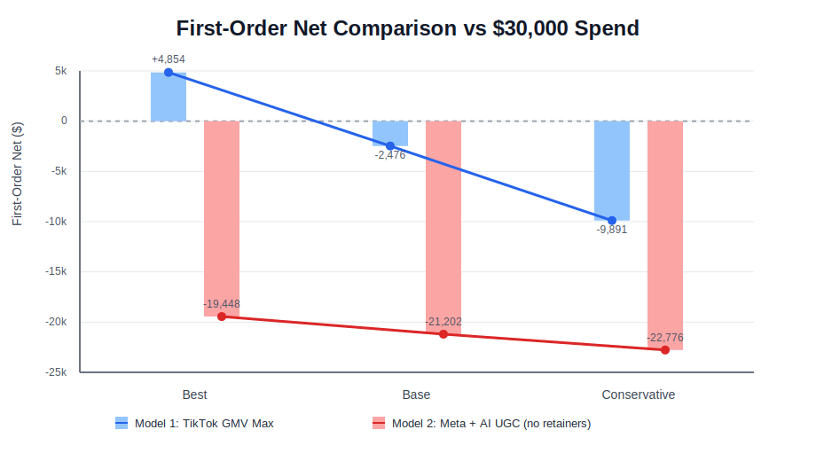

# Blended Supplement Brand Launch Models (AI UGC + Paid Media)

## Purpose

Build two realistic launch models for a blended brand (mobile app health protocols + physical supplements), using:

- The same unit economics as your prior model
- AI talking-head UGC at high volume (ArcAds or Captions)
- Paid ads on one primary channel at a time
- An experienced ads manager at **$800/month**

The goal here is **first-order acquisition modeling** with the cleanest available CPA evidence for supplements/wellness on TikTok and Meta.

---

## Locked Inputs (Inherited + Updated)

- **Marketing budget:** `$30,000` total launch envelope
- **Planning window:** `60 days` (2 months)
- **Agency / ads manager:** `$800/month` = **$1,600 per 60 days**
- **Unit economics (unchanged):**
  - List price: `$44`
  - Typical sale price: `30% off` -> **$30.80**
  - COGS: **$5.00**
- **AI UGC production:** ArcAds or Captions, high-volume talking-head format
- **Distribution style:** blast variations across multiple accounts (`5-10` per platform family), then scale paid spend

---

## CPA Research (Deep-Dive Synthesis)

## 1) TikTok Shop + GMV Max (Supplements / Wellness)

### TikTok benchmark anchors

- **TikTok official case study (Arrae, natural supplements):** GMV Max delivered **+17% CPA efficiency** vs standard shopping ads
  - Source: [TikTok for Business - Arrae](https://ads.tiktok.com/business/en-US/inspiration/arrae-gmv-max-natural-supplements)
- **TikTok official case study (Triquetra, supplements):** GMV Max hit **4x ROI** and **+136% GMV** (no absolute CPA disclosed)
  - Source: [TikTok for Business - Triquetra](https://ads.tiktok.com/business/en-US/inspiration/tiktok-case-study-triquetra-health-gmv-max)
- **Industry benchmark context (Health & Wellness on TikTok):** median CPA around **$16.87-$17.99**
  - Sources: [Triple Whale TikTok Benchmarks](https://www.triplewhale.com/blog/tiktok-benchmarks), [CreativeGrade TikTok Health & Fitness CPA](https://creativegrade.tech/benchmarks/health-fitness/tiktok/cpa)

### TikTok launch CPA for your exact scenario

Your scenario is stricter than many case studies because you want:

- AI content only
- No affiliate payouts
- No creator retainers

That usually reduces social-proof lift from real creators, so I modeled a **slightly more conservative launch CPA** than raw H&W median.

- **Modeled TikTok GMV Max CPA range:** **$15 (best) / $19 (base) / $26 (conservative)**
- **Most likely planning CPA:** **$19**

---

## 2) Meta (IG + FB) with AI UGC (no paid retainers)

### Meta benchmark anchors

- **Wellness/Holistic Health Facebook cost per purchase:** ~**$70.25 avg in 2025** (industry dataset)
  - Source: [Superads benchmark dataset](https://www.superads.ai/facebook-ads-costs/cost-per-purchase/wellness-holistic-health/conversion)
- **DTC supplements benchmark (paid social + search):** around **$89 CPA**
  - Source: [MHI DTC vertical benchmarks](https://mhigrowthengine.com/blog/average-cost-per-acquisition-by-dtc-vertical-2026/)
- **Health & Fitness Instagram benchmark context:** high CPAs are common in this vertical (often well above broad ecommerce medians)
  - Source: [CreativeGrade Instagram Health & Fitness CPA](https://creativegrade.tech/benchmarks/health-fitness/instagram/cpa)

### Meta launch CPA for your exact scenario

This scenario is **AI UGC only on Meta** (no paid creator retainers). Benchmarks below are still drawn from supplements/wellness D2C datasets, but vs a hybrid retained-creator program you may see **more creative fatigue** until trust/proof-heavy hooks convert; treat **$78** as the planning midpoint and **bias early decisions toward your conservative CPA** until you have live funnel data.

- **Modeled Meta CPA range:** **$65 (best) / $78 (base) / $95 (conservative)**
- **Most likely planning CPA:** **$78**

---

## Unit Economics (Kept the Same)

## A) Meta D2C order economics (same as prior model)

- Revenue per order: **$30.80**
- COGS per order: **$5.00**
- Contribution before marketing: **$25.80**
- First-order break-even CPA ceiling: **~$25.80**

## B) TikTok Shop paid order economics (no affiliate payout)

Using the same prior assumptions:

- Revenue per order: **$30.80**
- Referral fee (6%): **$1.85**
- Payment processing (~2.9% + $0.30): **$1.19**
- FBT fulfillment (~0.5 lb): **$3.10**
- COGS: **$5.00**
- Contribution before marketing: **$19.66**
- First-order break-even CPA ceiling: **~$19.66**

---

## AI Production Cost Assumption (ArcAds / Captions)

For high-volume talking-head output across multiple account clusters, a realistic planning line is:

- **$900/month** combined tooling + credit/overage buffer
- **$1,800 per 60 days**

Reference pricing signals:

- ArcAds market-observed plan anchors around low hundreds/month with custom volume tiers
- Captions ranges from low-cost monthly plans to scale tiers with significantly higher credit pools
- Sources: [ArcAds pricing review aggregate](https://dupple.com/tools/arcads-ai), [Captions pricing](https://www.mirage.app/pricing)

---

## Launch Model 1 - TikTok GMV Max + AI UGC (No Affiliate/Retainer Payments)

### Model 1 strategy

- Platform focus: TikTok Shop with GMV Max optimization
- Creative engine: AI UGC only (ArcAds/Captions)
- Creator economics: **$0 affiliate payouts**, **$0 retainer payouts**
- Ads manager actively manages budget/creative iteration and account segmentation

### Budget Build (60 days)

- Ads manager (`$800 x 2`): **$1,600**
- AI tooling (`$900 x 2`): **$1,800**
- Creator payouts: **$0**
- **Remaining ad spend:** `30,000 - 1,600 - 1,800 = 26,600`

### CPA + Order Scenarios (TikTok GMV Max)

- **Best case CPA $15:** `26,600 / 15 = 1,773` paid orders
- **Base case CPA $19:** `26,600 / 19 = 1,400` paid orders
- **Conservative CPA $26:** `26,600 / 26 = 1,023` paid orders

### Contribution Check (first-order)

Contribution per order = **$19.66**

- **Best:** `1,773 x 19.66 = $34,854`
- **Base:** `1,400 x 19.66 = $27,524`
- **Conservative:** `1,023 x 19.66 = $20,109`

### First-Order Net vs $30,000 Marketing Spend

- **Best:** `+ $4,854`
- **Base:** `- $2,476`
- **Conservative:** `- $9,891`

### Model 1 read

This is close to first-order breakeven in base case and clearly positive if CPA lands near high-teens/low-teens.

---

## Launch Model 2 - Meta (IG/FB) + AI UGC (No Retainer Payments)

### Model 2 strategy

- Platform focus: Meta ads (IG + FB)
- Creative engine: **AI UGC only** (ArcAds/Captions) at high variation volume
- Creator economics: **$0 retainer payouts** (same fixed marketing envelope as Model 1 for manager + AI tooling)
- Ads manager handles campaign build, segmentation, and optimization

### Model 2 budget build (60 days)

- Ads manager (`$800 x 2`): **$1,600**
- AI tooling (`$900 x 2`): **$1,800**
- Creator retainers: **$0**
- **Remaining ad spend:** `30,000 - 1,600 - 1,800 = 26,600`

### CPA + Order Scenarios (Meta)

- **Best case CPA $65:** `26,600 / 65 = 409` paid orders
- **Base case CPA $78:** `26,600 / 78 = 341` paid orders
- **Conservative CPA $95:** `26,600 / 95 = 280` paid orders

### Model 2 contribution check (first-order)

Contribution per order = **$25.80**

- **Best:** `409 x 25.80 = $10,552`
- **Base:** `341 x 25.80 = $8,798`
- **Conservative:** `280 x 25.80 = $7,224`

### Model 2 first-order net vs $30,000 marketing spend

- **Best:** `- $19,448`
- **Base:** `- $21,202`
- **Conservative:** `- $22,776`

### Model 2 read

Meta remains strongly first-order negative under current unit economics, but **removing retainers adds ~$5.6k back into ad spend**, which improves order volume at the same CPA assumptions. This path still requires subscription/app-LTV recovery and back-end monetization to be rational at first-order contribution.

---

## Side-by-Side Decision Snapshot

- **Model 1 (TikTok GMV Max, no creator payouts):** much stronger first-order economics; can be near break-even at base CPA.
- **Model 2 (Meta + AI UGC, no retainers):** better for brand control and data ownership on your site; still relies heavily on LTV, upsells, and retention at these CPAs.
- **If objective is fastest payback:** prioritize Model 1.
- **If objective is long-term owned customer data + brand equity:** Model 2 is viable only with aggressive LTV strategy (app continuity, subscriptions, bundles).

### Comparison Graphs

| CPA Comparison | First-Order Net Comparison |
| --- | --- |
|  |  |

That makes the TikTok GMV Max model materially stronger for near-term cash efficiency, while Meta should be treated as a longer-horizon LTV play.

---

## Recommended Execution Rules (Both Models)

- Launch with 3-phase pacing: `test -> stabilize -> scale` each in 2-week blocks
- Keep CPA guardrails strict:
  - TikTok GMV Max warning threshold: `>$22`
  - Meta warning threshold: `>$85`
- Rotate creative in high cadence (especially AI assets) to manage fatigue
- Segment accounts by audience intent and offer angle (not random duplication)
- Track first-order and 60-day payback separately so app/protocol retention is visible

---

## Addressing Pain Points

## 1) CPA accuracy (especially Meta) and blended ecommerce impact

- **Short answer:** TikTok CPA confidence is higher than Meta in this model because TikTok inputs include platform-native supplement case studies plus category benchmarks, while Meta relies more on broad vertical benchmark datasets that can vary by funnel quality.
- **Are Meta estimates still usable?** Yes, but treat **$78 base CPA** as a planning midpoint, not a precision forecast. A realistic launch uncertainty band is roughly **+/-20-30%** until your first 2-4 weeks of live data.
- **Does this account for your blended model (physical supplement + app protocol)?** Partially. This model prices acquisition on the **first physical order** only. If your ads/message also sell the protocol outcome and increase trust, blended positioning can lower CPA versus commodity supplement ads, but only after creative-market fit is proven.
- **Planning implication:** Keep Meta in a scenario framework (`low / base / high`) and make scaling decisions from your own early blended-funnel data, not benchmark averages alone.

## 2) AI video content feasibility on TikTok vs Meta

- **TikTok:** High feasibility. AI talking-head/UGC-style content can perform if hooks are native, pacing is fast, and variation volume is high.
- **Meta:** Moderate feasibility. AI content can work, but Meta often rewards stronger trust cues (real creator identity, social proof, comments, proof visuals), so fully synthetic creative may fatigue faster.
- **Operational takeaway:** AI-only is more naturally aligned with TikTok testing velocity; on Meta, AI usually performs better when blended with real creator assets and proof-heavy direct response formatting.

## 3) Complexity of running ads on Meta vs TikTok

- **Meta complexity profile:** More mature but heavier account structure, audience/placement control options, attribution interpretation, and creative fatigue management across IG/FB surfaces.
- **TikTok complexity profile:** Simpler to launch quickly, but winning requires rapid creative iteration, strong hook testing, and tighter trend/native-style adaptation.
- **Net assessment for your setup:** Meta is generally more complex on campaign architecture and reporting nuance; TikTok is more complex on creative velocity discipline. For this plan, TikTok is still the simpler path to first signal because the model is built around high-volume AI creative testing.

## 4) TikTok specialist availability at ~$800/month (quality + communication)

- **Can you find one at this price?** Yes, but quality variance is high. At **~$800/month**, you are typically hiring a solo media buyer/freelancer or a junior pod, not a senior strategic team.
- **India ban constraint:** Since TikTok is restricted in India, pure India-based talent pools can be thinner for current hands-on TikTok Ads operations. You may need to source from regions with active TikTok ad ecosystems.
- **How to protect quality at this budget:**
  - Require platform screenshots/live account evidence from recent TikTok campaigns (not just Meta case studies).
  - Use a 2-4 week paid trial with clear KPIs: launch speed, creative test count, CPA trend, reporting clarity, response-time SLA.
  - Ask for weekly optimization logs and test hypotheses to verify real operator depth.
- **Practical expectation:** Same price can work, but do not assume same quality by default; process rigor and trial structure matter more than headline rate.

---

## 5) Creative economics (especially with AI-heavy testing)

Both platforms punish weak creative, but they punish differently:

- TikTok can scale when you can produce lots of variants cheaply that feel native (rapid hook testing helps a lot).
- Meta often needs credibility-heavy creatives to convert cold traffic reliably to a Shopify-style purchase, especially in health/supplements—which can inflate CPA unless you nail offer, proof, page speed, and retargeting.

## 6) “Everyone says Meta is best for a new brand to grow on.”

General advice often pushes Meta first because **scale, mature tooling, attribution surfaces, remarketing**, and broad reach make it workable for cold-start D2C: you can accumulate **pixel events**, audiences, creative learnings, and owned customer data faster than starting from scratch on niche channels alone.

That does **not** mean Meta is unconditionally “best” for your launch—it means Meta is often **recommended as a predictable learning environment** once you accept **higher first-order CPA** in competitive verticals. For supplements/wellness and your modeled CPAs, **near-term acquisition efficiency may still favor TikTok Shop**, while Meta may be the stronger **long-game** channel for **remarketing + LTV** if creative and funnel convert.

## 7) “Others recommend TikTok for a new brand.”

That usually reflects **native creative fit**, **algorithmic discovery**, and sometimes **lower near-term CPA** for the right offer—but it still depends on **Shop vs off-Shop economics**, compliance, and whether you can sustain **creative volume**. Same rule as Meta-first advice: **test small**, hold your **CPA guardrails**, and scale what clears **marginal contribution** for your funnel.

**How to reconcile the advice:** treat “start on Meta” or "start on TikTok" as *one* of two strategy pillars, not gospel—validate with small parallel tests against your numeric guardrails (`>$85` warning on Meta, `>$22` on TikTok GMV Max in your doc), and prioritize the platform that hits **marginal CPA vs contribution margin** given your Shopify vs Shop economics.

---

## Final Takeaway

With your constraints (same unit economics, $800/mo ads manager, high-volume AI UGC), the most accurate current benchmark-driven expectation is:

- **TikTok GMV Max scenario:** launch CPA likely around **$19** (range **$15-$26**)
- **Meta + AI UGC scenario (no retainers):** launch CPA likely around **$78** (range **$65-$95**); without paid creators, monitor whether live CPA trends toward the **conservative** end until creative converts.
